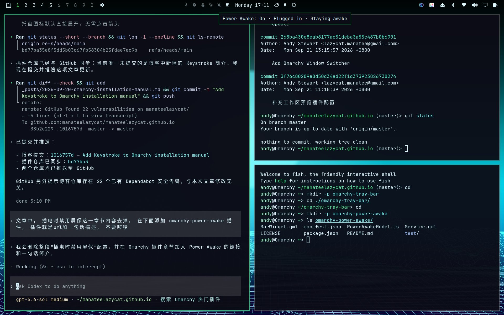

# Omarchy Power Awake



Keeps desktops awake and automatically stays awake on laptops while plugged in, restoring the screensaver and lock screen on laptop battery power.

The plugin adds a power-plug icon to the center of the Omarchy bar. Click the icon to turn the option on or off. The option is enabled by default on first use, and your selection persists across shell restarts.

## Install

```bash
omarchy plugin add https://github.com/manateelazycat/omarchy-power-awake.git --enable
```

No additional scripts, systemd services, or configuration are required.

## Behavior

| Option | Machine / power source | Result |
| --- | --- | --- |
| On | Desktop (no laptop battery) | Screensaver and idle lock are disabled |
| On | Laptop plugged in | Screensaver and idle lock are disabled |
| On | Laptop on battery | Screensaver and idle lock use the normal Omarchy timeouts |
| Off | Any | Screensaver and idle lock use the normal Omarchy timeouts |

The plugin uses Quickshell's UPower service to detect a laptop battery and react to power-source changes, and Omarchy's idle service IPC to control Stay Awake. Wireless peripheral batteries do not make a desktop count as a laptop. It does not modify timeout values in `~/.config/omarchy/shell.json`.

## Command line

```bash
omarchy-shell io.github.manateelazycat.power-awake status
omarchy-shell io.github.manateelazycat.power-awake enable
omarchy-shell io.github.manateelazycat.power-awake disable
omarchy-shell io.github.manateelazycat.power-awake toggle
```

## Update

```bash
omarchy plugin update io.github.manateelazycat.power-awake --yes
```

## Remove

```bash
omarchy plugin remove io.github.manateelazycat.power-awake
```

Removing or disabling the plugin restores normal Omarchy idle handling.

## Requirements

- Omarchy 4 (Quattro)
- UPower, included with Omarchy

## Development

```bash
npm test
omarchy plugin validate .
qmllint -I "$OMARCHY_PATH/shell" BarWidget.qml Service.qml
```

## License

GPL-3.0-only
